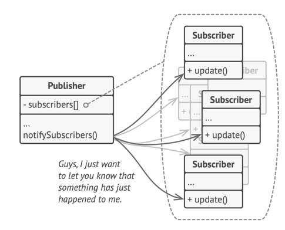

# observer-example

This is an example of how to use automatic refactorings to implement the observer pattern.

## What is the observer pattern?

The observer pattern is a design pattern in which an object, called the subject, maintains a list of
its dependents, called observers, and notifies them automatically of any state changes, usually by
calling one of their methods.

The object that has some interesting state is often called subject, but since it’s also going to
notify other objects about the changes to its state, we’ll call it publisher. All other objects that
want to track changes to the publisher’s state are called subscribers.

[More info](https://refactoring.guru/design-patterns/observer)

## Real word analogy

A good example would be a newspaper subscription. Anyone who subscribes to a newspaper will get a
newspaper when it is published. The newspaper is the publisher and the subscribers are the
people who subscribe to the newspaper.

## How to use refactorings to implement the observer pattern?

1. Rename all the subscribers methods to the same name. This will be the method that the publisher
   will call to notify the subscribers.

2. Extract an interface from the publisher and make the subscribers implement it.

3. Introduce a field in the publisher that will hold the subscribers.

4. Initialize the subscribers field in the publisher constructor or create a method to add
   subscribers to the publisher.

5. Replace the method calls to the subscribers with calls to the method that notifies the
   subscribers.
